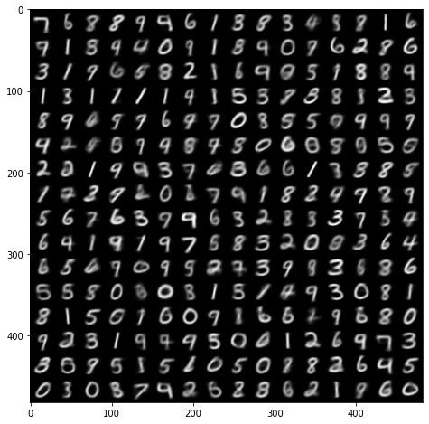
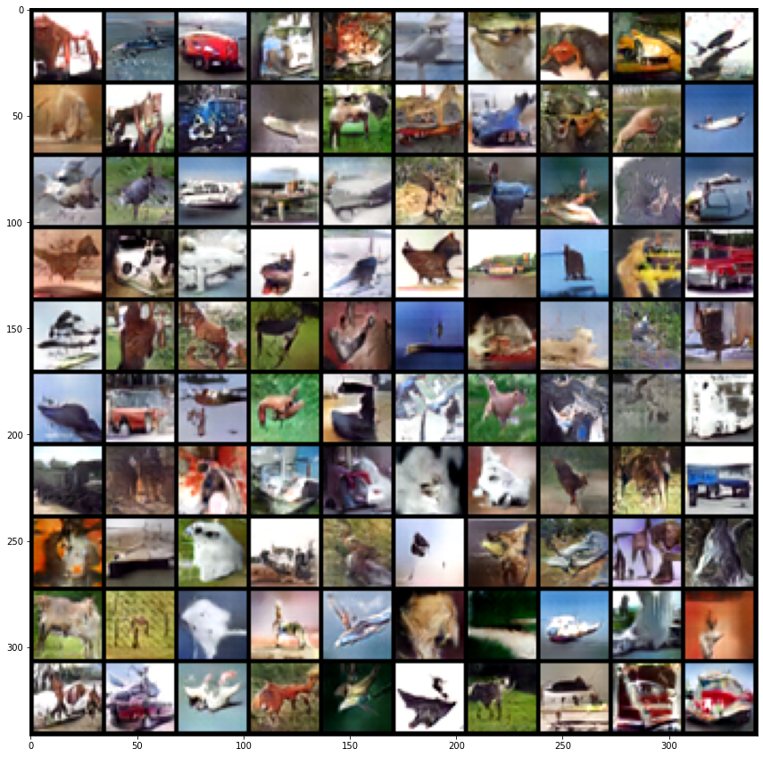

# generative_models
Implementation from scratch of a GAN and a VAE

The VAE is trained on the [MNIST dataset](https://en.wikipedia.org/wiki/MNIST_database. \
The DCGAN is trained on the the CIFAR-10 dataset.

<table><tr>
<td> 
  

    
     
    <em style="color: grey">Generated image by VAE</em>
  
 
</td>
<td> 
  

    
     
    <em style="color: grey">Generated image by GAN</em>
  
 
</td>
</tr></table>